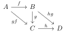

Given [[morphism|morphisms]] $\mor{f}{A}{B}$, $\mor{g}{B}{C}$, and $\mor{h}{C}{D}$, the following [[diagram]][^1] commutes.

[^1]: Generated with [Ti*k*Z](https://www.ctan.org/pkg/tikz-cd) and the [Poppler](https://poppler.freedesktop.org/) tool utility `pdftocairo`.
